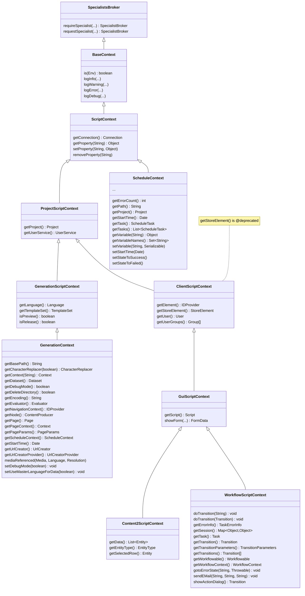

# FirstSpirit Contexts

Class hierarchy of the FirstSpirit script contexts (replaces the former
`firstspirit-context-hierarchy.png` poster). Edit the Mermaid block below to update; it renders
in GitHub, Confluence, VS Code, Obsidian and most Markdown viewers.



## Inheritance (plain text)

```
SpecialistsBroker
└── BaseContext
    └── ScriptContext
        ├── ProjectScriptContext
        │   ├── GenerationScriptContext
        │   │   └── GenerationContext
        │   └── ClientScriptContext
        │       └── GuiScriptContext
        │           ├── Content2ScriptContext
        │           └── WorkflowScriptContext
        └── ScheduleContext
```
